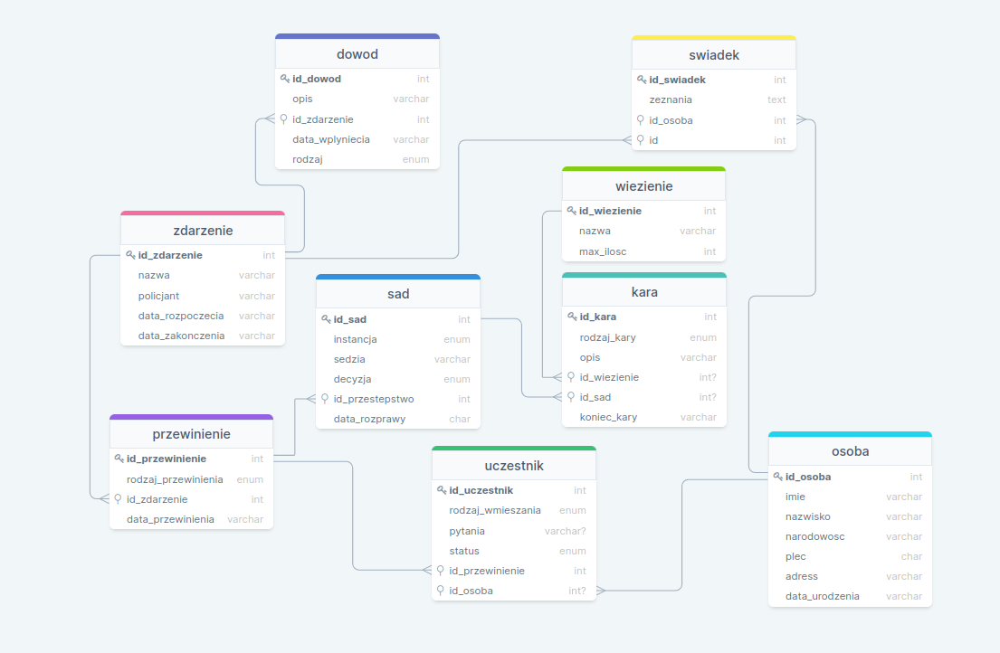
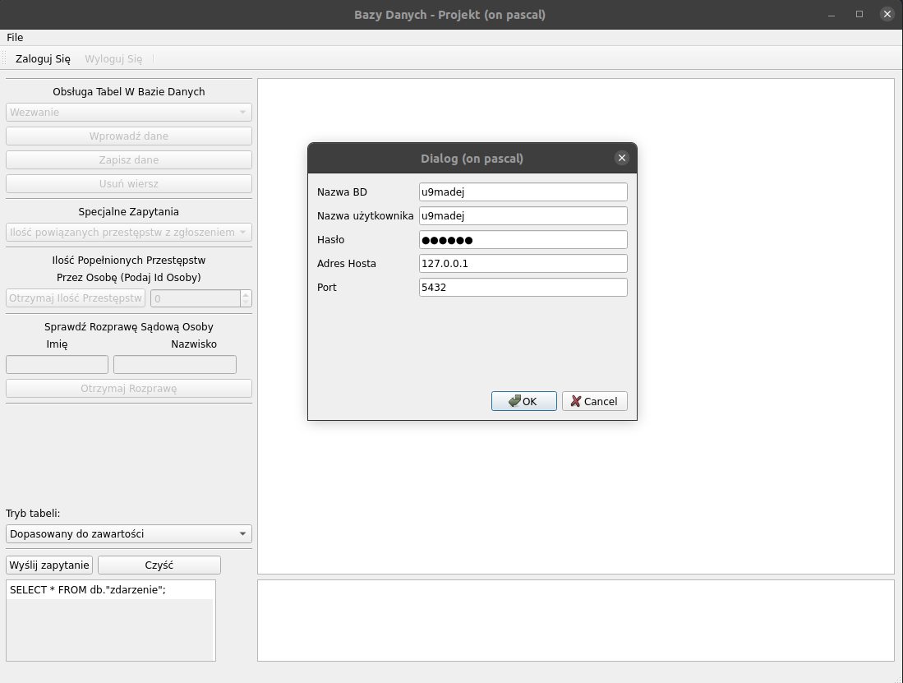
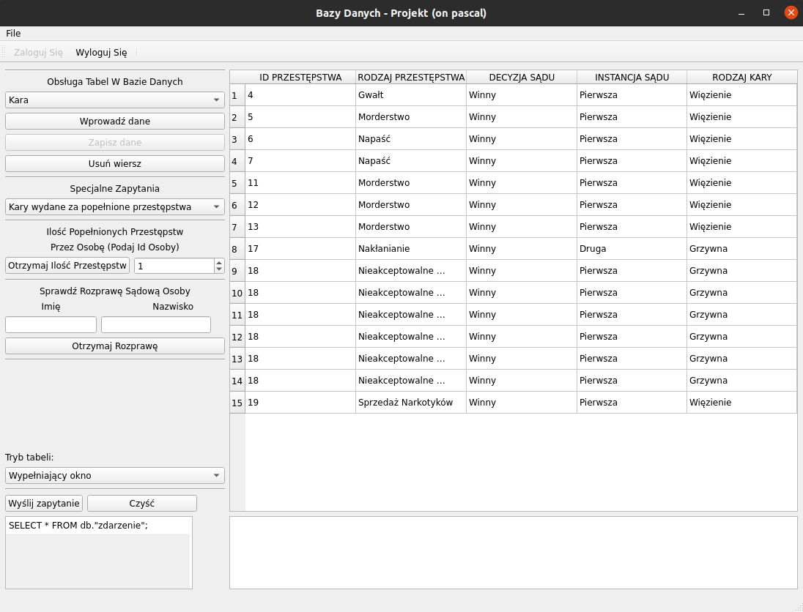
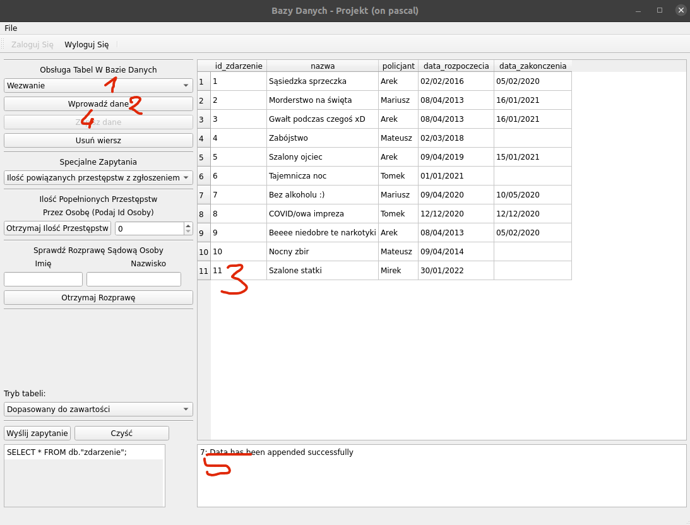

PROJEKT Z BAZY DANYCH 1
=======================
BAZA DANYCH POLICJI
====================

URUCHOMIENIE APLIKACJI
-----------------------
Aplikacja znajduje się na serwerze pascal, aby ją uruchomić należy przekopiować komende:

    /home/stud2019/9madej/BD1/DistributionKit/POLICE_DATABASE.sh

Projekt koncepcji, założenia
----------------------------
1. Zdefiniowanie tematu projektu:
Projekt ma za zadanie ułatwienie przeprowadzania śledztw dotyczących różnych przestępstw i wykroczeń. Projekt ma za zadanie umożliwić odbiór zgłoszenia, przeprowadzenie śledztwa, przesłuchania świadków, poszkodowanych, oraz przestępców, a także pomóc w zapisie informacji na temat sprawy sądowej i w dalszej części opis wydaneo wyroku, powinna służyć również jako spis ludności.
2. Analiza wymagań użytkownika(policjanta):
Użytkownik może wprowadzać:
 * zapis zgłoszenia, oraz wszelkie operacja policjanta jak dotrze takie jak przesłuchanie świadków, poszkodowanych, winnych,
 * przeprowadzenia sprawy sądowej oraz zapis kary,
 * spis ludności,
 Użytkownik może odczytać:
 * dostęp do pojyńczych tabel,
 * szereg zapytań, pomagających w dochodzeniu takich jak status zgłoszenia itd.
 3. Zaprojektowanie funkcji:
 * odczyt histori przestępstw danej osoby,
 * sprawdzenie nie zakończony zgłoszeń,
 * lista osób przebywających w więzieniach,
 * lista osób którzy otrzymali karę pieniężną,
 * odczyt zeznania świadków,
 * skojarzenie zgłoszenia z powiązanymi przestępstwami.
    
 Projekt diagramów (konceptualny)
 -------------------------------
4. Zdefiniowanie encji i relacji pomiędzy nimi.

5. Opis Tabel:
  * [zdarzenie] - reprezentuje wydarzenie do którego policjant jest wezwany,
  * [przewinienie] - reprezentuje dokonane przestępstwo,
  * [sad] - reprezentuje sprawę w sądzie,
  * [kara] - reprezentuje otrzymana karę,
  * [więzienie] - opisuje więzienie,
  * [uczestnik] - reprezentuje osobę wmieszaną w 'przewinienie',
  * [osoba] - reprezentuje spis ludności,
  * [swiadek] - reprezentuje świadka zdarzenia,
  * [dowod] - reprezentuje zebrane dowody podczas zdarzenia.

Projekt logiczny
-------------------
6. Projektowanie tabel, kluczy, indeksów.
  

| Nazwa atrybutu               |  Typ danych                            | Opis
|------------------------------|----------------------------------------|------------------------------------------------------------------------------------------
| <b>`zdarzenie`</b>           |                                        |
| `id_zdarzenie`               | `INTEGER NOT NULL`                     | klucz główny
| `nazwa`                      | `VARCHAR(50) NOT NULL`                 | nazwa opisująca zdarzenie
| `policjant`                  | `VARCHAR(25) NOT NULL`                 | Imię policjanta który prowadzi sprawę
| `data_rozpoczecia`           | `CHAR(10) NOT NULL`                    | data rozpoczęcia sprawy
| `data_zakonczenia`           | `CHAR(10) DEFAULT NULL`                | Jeśli sprawa zakończona data zakończenia
| <b>`przewinienie`</b>        |                                        |
| `id_przewinienie`            | `INTEGER NOT NULL`                     | klucz główny
| `rodzaj_przewinienia`        | `ENUM NOT NULL`                        | rodzaj przewinienia
| `data_przewinienia`          | `CHAR(10) NOT NULL`                    | data dokonanego przestępstwa
| `id_zdarzenie`               | `INTEGER NOT NULL`                     | nawiązuje do tabeli <b>`zdarzenie`</b> w relacji n:1
| <b>`dowod`</b>               |                                        |
| `id_dowod`                   | `INTEGER NOT NULL`                     | klucz główny
| `rodzaj`                     | `ENUM NOT NULL`                        | rodzaj dostarczonego dowodu
| `opis`                       | `VARCHAR(50) NOT NULL`                 | Dokładne opisanie znalezionego dowodu
| `data_wplyniecia`            | `CHAR(10) NOT NULL`                    | data wpłynięcia dowodu
| `id_zdarzenie`               | `INTEGER NOT NULL`                     | nawiązuje do tabeli <b>`zdarzenie`</b> w relacji n:1
| <b>`sad`</b>                 |                                        |
| `id_sad`                     | `INTEGER NOT NULL`                     | klucz główny
| `instancja`                  | `ENUM NOT NULL`                        | instancja sądu
| `sedzia`                     | `VARCHAR(25) NOT NULL`                 | nazwa śedzi prowadzącego rozprawę
| `decyzja`                    | `ENUM NOT NULL`                        | decyzja sądu
| `data_rozprawy`              | `CHAR(10) NOT NULL`                    | data rozprawy
| `id_przestępstwo`            | `INTEGER NOT NULL`                     | odnośnik do przęstępstwa którego bedzię się dotyczyła sprawa sądowa,nawiązuje do tabeli <b>`przewinienie`</b> w relacji n:1
| <b>`kara`</b>                |                                        |
| `id_kara`                    | `INTEGER NOT NULL`                     | klucz główny
| `rodzaj_kary`                | `ENUM NOT NULL`                        | rodzaj kary
| `opis`                       | `VARCHAR(50) NOT NULL`                 | opis otrzymanej kary
| `koniec_kary`                | `CHAR(10) DEFAULT NULL`                | data zakończenia kary
| `id_wiezienie`               | `INTEGER DEFAULT NULL`                 | nawiązuje do tabeli <b>`więzienie`</b> w relacji n:1, jeśli skazany dostanie karę więzienia jest mu przypisywane więzienie
| `id_sad`                     | `INTEGER DEFAULT NULL`                 | nawiązuje do tabeli <b>`id_sad`</b> w relacji n:1, odnosi się do przeprowadzonej rozprawy
| <b>`osoba`</b>               |                                        |
| `id_osoba`                   | `INTEGER NOT NULL`                     | klucz główny
| `imie`                       | `VARCHAR(25) NOT NULL`                 | imię osoby
| `nazwisko`                   | `VARCHAR(25) NOT NULL`                 | nazwisko osoby
| `narodowość`                 | `VARCHAR(10) NOT NULL`                 | narodowość osoby
| `plec`                       | `CHAR(1) NOT NULL`                     | płec osoby
| `adres`                      | `VARCHAR(50) NOT NULL`                 | adres osoby
| `data_urodzenia`             | `CHAR(10) NOT NULL`                    | data urodzenia osoby
| <b>`wiezienie`</b>           |                                        |
| `id_wiezienie`               | `INTEGER NOT NULL`                     | klucz główny
| `nazwa`                      | `VARCHAR(50) NOT NULL`                 | nazwa więzienia
| `max_ilosc`                  | `INTEGER NOT NULL`                     | maksymalna pojemność więzienia
| <b>`uczestnik`</b>           |                                        |
| `id_uczestnik`               | `INTEGER NOT NULL`                     | klucz główny
| `rodzaj_wmieszania`          | `ENUM NOT NULL`                        | rodzaj wmieszania w zdarzenie
| `pytania`                    | `VARCHAR(50) DEFAULT NULL`             | pytania
| `status`                     | `ENUM NOT NULL`                        | status osoby('Martwy','Żywy','Zaginiony','Nieznany')
| `id_przewinienie`            | `CHAR(10) NOT NULL`                    | data wpłynięcia dowodu
| `id_zdarzenie`               | `INTEGER NOT NULL`                     | nawiązuje do tabeli <b>`zdarzenie`</b> w relacji n:1, wiele uczestników może należec do jednego zdarzenia  
| `id_osoba`                   | `INTEGER NOT NULL`                     | nawiązuje do tabeli <b>`osoba`</b> w relacji n:1 
| <b>`swiadek`</b>             |                                        |
| `id_swiadek`                 | `INTEGER NOT NULL`                     | klucz główny
| `zeznania`                   | `VARCHAR(50) NOT NULL`                 | zeznania świadka
| `id_osoba`                   | `INTEGER NOT NULL`                     | nawiązuje do tabeli <b>`osoby`</b> w relacji n:1, każda osoba może byc kilka razy swiadkiem
| `id_zdarzenie`               | `INTEGER NOT NULL`                     | nawiązuje do zdarzenia <b>`zdarzenie`</b> w relacji n:1, może być wielu świadków do jednej sprawy

7.Zaprojektowanie operacji na danych.
Zaprojektowane operacje na Bazie Danych znajduja się w [zapytania i procedury do bazy danych](Database/questions_and_procedures.sql).

Projekt funkcjonalny
-------------------
8. Do stworzenia aplikacji wykorzystano bibliotekę graficzną Qt. Aplikacja umożliwia dodawania, usuwanie rekordów w tabeli, odczytywanie, dokonywania specjalnych wcześniej przygotowanych pytań, okno to wprowadzania własnych komend oraz okno z logami.
* główne okno aplikacji wraz oknem logowania

* prezentacja wyświetlenia kary otrzymywane za dane przestępstwa

Dokumentacja
-------------
9. Aby wprowadzić dane do aplikacji należy:
  * wybrać nas interesującą tabele,
  * nacisnąć `Wprowadź dane`
  * Wypełnić pola
  * po wprowadzeniu należy nacisnąc przycisk `Zapisz dane` 
  ~ ewentualne informacje zwrotną o dodaniu zobaczymy w oknie z logami 
   
10.Aby usunąc dane z bazy nalezy zaznaczyć interesujacy nas wiersz oraz nacisnąć przysk `Usuń wiersz`.
11.Do wyświetlenia specjalnych zapytań należy wybrać z `Specjalne Zapytania` interesujące nas zapytanie.
12.Jeżeli chcemy sprawdzić ile dana osoba popełniła przestępstw należy wybrać `id_osoby` która nas interesuje i nacisnąć `Otrzymaj Ilość Przestępstw`
13.Jeżeli chcemy sprawdzić jakie rozprawy sądowe miała dana osoba nalezy podać imię i nazwisko oraz nacisnąć `Otrzymaj Rozprawę`
14. Tryb Tabeli ustawia w jaki sposób jest wyświetlana tabela.
15. Na samym dole znajduje sie okno do wpisywania poleceń do bazy danych, realizuje się ono po naciśnięciu `Wyślij zapytanie`.
16. Przycisk `Czyść` czyści konsole.
17. Dokumentacja kodu znajduje się w [docs](docs/).
# Wykaz Literatury:
- [Dokumentacja Qt](https://doc.qt.io/)
- [Kurs BD1](https://newton.fis.agh.edu.pl/~antek/index.php?sub=db_cw)
- [Dokumentacja PostgreSQL](https://www.postgresql.org/docs/)
